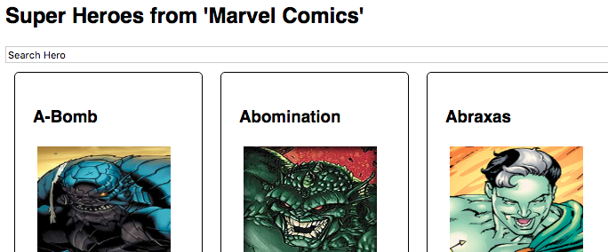

# react-exercise-1

## Due Date:
March 22, 2019, 23:59 (Friday of Week 9)

## Description
This is an **individual** exercise. The purpose of this exercise is to practice the concepts learned in the Tutorial 4 and React. This exercise has **three** independent parts.


### Part 1: Instructions
**Objective**: Complete the [react tutorial](https://reactjs.org/tutorial/tutorial.html) using [create-react-app ](https://github.com/facebook/create-react-app)

1. Use `app-1` as the package/project name for `create-react-app` command.
2. Complete the tutorial by typing code instead of copying directly from web page.

### Part 2: Instructions
**Objective**: Complete the [Thinking in React](https://reactjs.org/docs/thinking-in-react.html) using webpack

1. Use `npm` to create a new project/package named as 'app-2' which should be used for this part.
2. Read [Thinking in React](https://reactjs.org/docs/thinking-in-react.html) and follow the codes.
3. Each class should reside in a separate JS/JSX file.
4. Complete the guide by typing code instead of copying directly from web page.

### Part 3: Instructions
**Objective**: Extend the [webpack-example-react-3](https://github.com/janakanuwan/web-page-design/tree/master/webpack-example-react-3) to support searching heroes



1. Use `npm` to create a new project/package named as '**tutorial4-<MATRIC_NUMBER>**' (e.g. _tutorial4-a0123456b_) which should be used for this part. Use **your name** as the author.
2. Setting up a mock server to load data via HTTP.
	- Install '[json-server](https://github.com/typicode/json-server)' as a development dependency (i.e. `npm i -D json-server`).
	- Create a `test` directory inside project directory (e.g. `mkdir test`).
	- Copy [heroes_db.json](https://raw.githubusercontent.com/janakanuwan/web-page-design/master/webpack-example-react-3/test/heroes_db.json) to `test` directory. (Original Source: [superhero-api](https://github.com/akabab/superhero-api))
	- Add `json-server --watch test/heroes_db.json` to `packge.json` as a script.
	- Start the server using `npm run mock:REST` on a different terminal. (Why? This process will not exit until server runs)
	- Open the browser and go to `http://localhost:3000/heroes/` and you should be able to see all heroes.
	- Using 'GET' request type you can obtain heroes data.


3. You must use '[fetch API](https://developer.mozilla.org/en-US/docs/Web/API/Fetch_API/Using_Fetch)' load the data from server (e.g. `http://localhost:3000/heroes/1` for hero with id=1) .
**NOTE:** Now hero data is different than before! For image use 'images.sm'.
```json
  {
    "id": 1,
    "name": "A-Bomb",
    "slug": "1-a-bomb",
    "powerstats": {
      "intelligence": 38,
      "strength": 100,
      "speed": 17,
      "durability": 80,
      "power": 24,
      "combat": 64
    },
    "appearance": {
      "gender": "Male",
      "race": "Human",
      "height": [
        "6'8",
        "203 cm"
      ],
      "weight": [
        "980 lb",
        "441 kg"
      ],
      "eyeColor": "Yellow",
      "hairColor": "No Hair"
    },
    "biography": {
      "fullName": "Richard Milhouse Jones",
      "alterEgos": "No alter egos found.",
      "aliases": [
        "Rick Jones"
      ],
      "placeOfBirth": "Scarsdale, Arizona",
      "firstAppearance": "Hulk Vol 2 #2 (April, 2008) (as A-Bomb)",
      "publisher": "Marvel Comics",
      "alignment": "good"
    },
    "work": {
      "occupation": "Musician, adventurer, author; formerly talk show host",
      "base": "-"
    },
    "connections": {
      "groupAffiliation": "Hulk Family; Excelsior (sponsor), Avengers (honorary member); formerly partner of the Hulk, Captain America and Captain Marvel; Teen Brigade; ally of Rom",
      "relatives": "Marlo Chandler-Jones (wife); Polly (aunt); Mrs. Chandler (mother-in-law); Keith Chandler, Ray Chandler, three unidentified others (brothers-in-law); unidentified father (deceased); Jackie Shorr (alleged mother; unconfirmed)"
    },
    "images": {
      "xs": "https://cdn.rawgit.com/akabab/superhero-api/0.2.0/api/images/xs/1-a-bomb.jpg",
      "sm": "https://cdn.rawgit.com/akabab/superhero-api/0.2.0/api/images/sm/1-a-bomb.jpg",
      "md": "https://cdn.rawgit.com/akabab/superhero-api/0.2.0/api/images/md/1-a-bomb.jpg",
      "lg": "https://cdn.rawgit.com/akabab/superhero-api/0.2.0/api/images/lg/1-a-bomb.jpg"
    }
  }
```
4. Use all the powers (now there are 6 types instead of 4) in Hero's view
```javascript
// e.g.
powerstats: {
  intelligence: 38,
  strength: 100,
  speed: 17,
  durability: 80,
  power: 24,
  combat: 64
}
```
5. Add buttons to increment and decrement all powers (You are free to choose the button types, widths, sizes, icons)
  - NOTE: since there are 12 buttons, think about how you show them to a user (Hint: Use another React component)

6. You have to add a "search" (text) field to each publisher and when you type, heroes (whose name or part of name) matching the typed text should be displayed.

7. You should only use React state (e.g. no redux)


## Final Instructions
1. Compress above 3 parts (directories) in to `Tutorial4_<MATRIC_NUMBER>.zip` **without** `node_modules` in each directory.
2. Submit it to IVLE.

## Deliverables:
- The **project folder** with name `Tutorial4_<MATRIC_NUMBER>`
- An **instruction file** on how to the run the code (e.g. _README.md_ file) **inside** your _project folder_

## Submitting Exercise
All deliverables should be archived into a .zip file with the following naming convention:
```
Tutorial4_<MATRIC_NUMBER>.zip
```
submitted to the IVLE "Tutorial 4 Exercise" workbin ("Files" > "Tutorials" > "Tutorial 4 Exercise") before March 15, 2019, 23:59.

