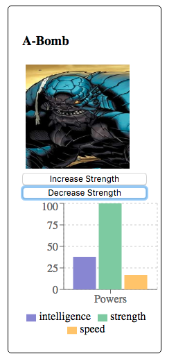

# webpack-example-react-3

We want to change the UI as follows:


NOTE: Now 'Powers' are shown in a bar chart.

## steps


1. Let's use '[Recharts](http://recharts.org/en-US/)'. Install '[recharts](https://github.com/recharts/recharts)' as a dependency
```bash
npm i -S recharts
```
>- Why is it added as (production) dependency?

2. Add a [barchart](http://recharts.org/en-US/examples/SimpleBarChart) to `src/view/PowerStats.jsx`
```javascript
import React from 'react'
import {
    BarChart, Bar, Cell, XAxis, YAxis, CartesianGrid, Tooltip, Legend,
} from 'recharts'

class HeroPowerChart extends React.Component{

    render(){
        const {data} = this.props;

        return (
            <BarChart
                width={200}
                height={200}
                data={data}
                margin={{
                    top: 5, right: 5, left: 0, bottom: 5,
                }}
            >
                <CartesianGrid strokeDasharray="3 3"/>
                <XAxis dataKey="name"/>
                <YAxis/>
                <Tooltip/>
                <Legend/>
                <Bar dataKey="power1" fill="#8884d8"/>
                <Bar dataKey="power2" fill="#82ca9d"/>
                <Bar dataKey="power3" fill="#ffc658"/>
            </BarChart>
        );
    }
}
```

```javascript
class PowerStats extends React.Component {

    render() {

        const {data} = this.props;

        const data1 = [
            {
                name: 'Powers', power1: 40, power2: 50, power3: 60,
            }
        ];

        return (
            <HeroPowerChart data={data1}/>
        );
    }
}
```

>- What is the relationship between `<Bar dataKey='power1' />` and graph legends and values?
>- What is the relationship between `<XAxis dataKey='name' />` and graph X-label?
>- How to fix the legends to show 'intelligence', 'strength' and 'speed'?

3. Let's add buttons to `src/view/Hero.jsx`
```javascript
// src/view/Hero.jsx
class Hero extends React.Component{

    // ...
    
    render(){
        const {hero} = this.props;

        return (
            <div className={"hero-item"}>
                <h3>{hero.name}</h3>
                
                
                {/* New buttons */}
                <button>Increase Strength</button>
                <button>Decrease Strength</button>
                
                <PowerStats data={hero.powerstats}/>
            </div>
        );
    }
}
```

4. Let's handle events to change the chart values
```javascript
// src/view/Hero.jsx
class Hero extends React.Component{

    constructor(props){
        super(props);

        // This binding is necessary to make `this` work in the callback
        this.increaseStrength = this.increaseStrength.bind(this);
        this.decreaseStrength = this.decreaseStrength.bind(this);
    }

    increaseStrength(e) {
        // TODO
        console.log(e);
    }

    decreaseStrength(e) {
        // TODO
        console.log(e);
    }

    render(){
        const {hero} = this.props;

        return (
            <div className={"hero-item"}>
                <h3>{hero.name}</h3>
                

                <button onClick={this.increaseStrength}>Increase Strength</button>
                <button onClick={this.decreaseStrength}>Decrease Strength</button>

                <PowerStats data={hero.powerstats}/>
            </div>
        );
    }
}
```
>- Why 'onClick' is in camel case instead of 'onclick' as in HTML button format?
>- Why do you have to bind functions inside the constructor?

5. Using local state to show values
    - Where should we keep that state? How do we decide that? Hint: [Thinking in React](https://reactjs.org/docs/thinking-in-react.html)
    - Which data should we keep in the _state_?

```javascript
// src/view/Hero.jsx
class Hero extends React.Component{

    constructor(props){
        super(props);

        const {hero} = props;
        // NOTE: adding local state to class
        // NOTE: we create a local state, and set the initial values from 'props'
        this.state = {
            intelligence: hero.powerstats.intelligence,
            strength: hero.powerstats.strength,
            speed: hero.powerstats.speed
        };

        // This binding is necessary to make `this` work in the callback
        this.increaseStrength = this.increaseStrength.bind(this);
        this.decreaseStrength = this.decreaseStrength.bind(this);
    }
    
    // ...

    render(){
        const {hero} = this.props;

        return (
            <div className={"hero-item"}>
                <h3>{hero.name}</h3>
                

                <button onClick={this.increaseStrength}>Increase Strength</button>
                <button onClick={this.decreaseStrength}>Decrease Strength</button>
                {/* NOTE: Now we use 'state' instead of 'props' */}
                <PowerStats data={this.state}/>
            </div>
        );
    }
}
```

6. Changing the state based on events
    - What is the expected behavior of the state when you click "Increase Strength" (or "Decrease Strength")?
    - How can we change the state? Hint: Use the inbuilt `this.setState()` to update the component's local state
    - IMPORTANT: Three things you should know about [setState()](https://reactjs.org/docs/state-and-lifecycle.html#using-state-correctly)
           - Do Not Modify State Directly 
           - State Updates May Be Asynchronous
           - State Updates are Merged

```javascript
// src/view/Hero.jsx

// ...

    increaseStrength() {
        // NOTE: we do not directly change the state since it should be immutable
        // NOTE: we can assign a new value to a property of the state instead of replacing whole state!
        console.log("Before clicking Increase Strength Button");
        console.log(this.state);
        this.setState( state => ({
            strength: state.strength + 5
        }));
        console.log("After clicking Increase Strength Button");
        console.log(this.state);
    }

    decreaseStrength() {
        this.setState( state => ({
            strength: state.strength - 5
        }));
    }

// ...

```
